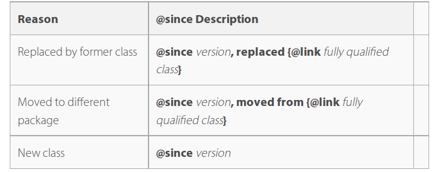
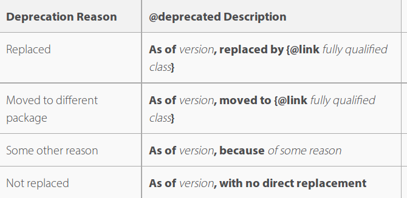
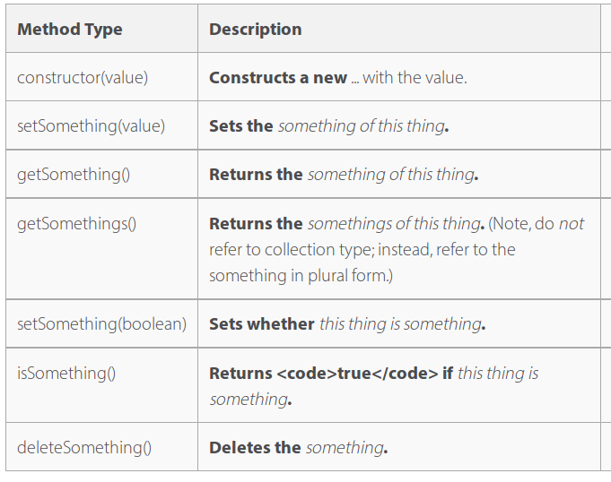

# Javadoc Guidelines
Source: 
## General guidelines
 - Javadoc has support for html syntax and it is recommended to use `<p>` and `</p>`.
 - Never leave blank lines at the beginning or end of the comment
 - Leave one blank line between paragraphs, lists
 - HTML Rules:
 	- tables must be nested within paragraphs
	- preformatted test must be nested within paragraphs
	- code must be nested within pre-format tags
	- All keywords, special constants and file names in code tags
 - @see and @link should include full path unless the class is in another package
 - Use a *single* space between a period ending a sentence and the start of the next sentence

## Documenting a class
 - Initial class description (=first paragraph):
 	- **first sentence should describe the class nearly and concisely**
	- Followup sentences support the first sentence with important points about the class
	 - Start with a verb
	 - Never begin with "this class"

 - Additional paragraphs: more information on the class purpose, abilities and general role. For simple classes this additional information is not necessary

 - Recommended tags:
 	- @author (**required**) for each author, from first to most recent
	- @see to other closely related classes whose javadocs gives the reader a clearer picture of the purpose of this class
	- @since should used in cases when the class is a class that replaces an another class or where the class has been moved to a new package
	
	- @deprecated should provide a short description that includes the release version of initial deprecation.
	

## Documenting a method
The following information should be present in the javadoc comment on each method:
 - Short, one sentence description of the method: the first sentence should begin with a verb at the third person. For this first sentences the choice of the verb is a convention:
	 
 - additional sentences/paragraphs providing more information on the method's purpose and function. Any information the user of the method would find useful should be included here (special requirements, circumstances where it should/should not be used). For many methods this is not necessary, particularly for getters and setters. Some advice:
 	- Start the description with Returns... for a method used primarily for the value it returns
	- Distinguish between overload and redefinition, describing them differently in the first sentence
 - usage examples if necessary and possible. Trivial methods don't need this. If too large use @link
 - Recommended tags:
 	- @param the parameters, in order, with descriptions. Never start the parameter name description with a capital letter and always refer to it with "the" rather than "a". If a boolean use the word *whether*.
	- @return all possible return values. If a method returns null, this should be explicitly stated, otherwise the reader should assume the method will always return its designated type. Should not be included if return value is void. Always refer to the returned object with "the"
	- @throws short description of the exceptions the method can throw, in order, with explanations of the actions that would trigger them.
	- @see to use only when there are more details about something that could be gained by reading the docs for another method or class
	- @since to use only if the method is a result of renaming a former method, or, optionally, when the method is newly introduced to an existing class.
	- @deprecated short description including release/version of initial deprecation....
Example:

```
/**
 * Returns the localized preferences values for the key, optionally using the
 * default language if the no localization exists for the requested
 * language.
 *
 * @param  preferences the preferences container
 * @param  key the preferences key
 * @param  languageId the id of the language
 * @param  useDefault whether to use the default language if no localization
 *         exists for the requested language
 * @return the localized preferences values. If <code>useDefault</code> is
 *         <code>false</code> and no localization exists for the requested
 *         language, an empty array will be returned.
 */
     public String[] getPreferencesValues(
     	PortletPreferences preferences, String key, String languageId,
		boolean useDefault);
	     )
```
### Interfaces and sub-classes
Interface method javadoc is always required.

Sub-class methods javadoc is required for methods of subclasses that have differences from their parent class(es) that should be noted: different behavior, side effects and/or different requirements of their parameters. **Otherwise the method javaodc of the interface or super-class ins applied to sub-class automatically**


**Pour beaucoup d'exemples lire le lien en debut de ce document**
